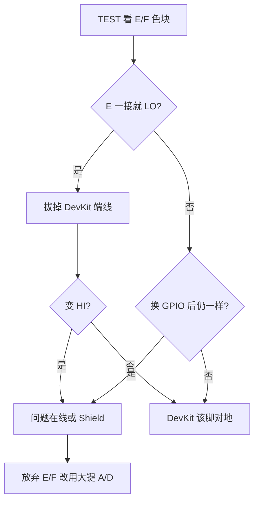

# 02 — E/F 小键故障与大键改映射（2026-08-29）

> 结论先说：**Shield 的 E/F 小键（或对应杜邦线）本机不可用**；固件改为  
> **上键 A = START、左键 D = SELECT**，E/F **可不接**。方案已上板验证。

权威接线：`main/input_gamepad.h`（`PAD_ENABLE_EF_KEYS` 现为 `0`）。

## 现象

1. 进马里奥后像「没按键 / 不开局」——标题画面需要 **START**。
2. TEST 诊断里：
   - **E（START）一接入就绿 + `LO`**（等于一直按着）
   - **F（SELECT）怎么按都灰 + `HI`**（等于一直没接到）
3. 换 DevKit 脚（GPIO7/8 → GPIO21/47）**现象不变** → 不是那两颗 ESP 脚坏了。
4. 一度以为「左键 D 也坏了」——后来发现是 **D 线接错脚**，纠正后正常。

## 排查思路（一次只改一个变量）



本机关键对照：

| 操作 | 结果 | 含义 |
|------|------|------|
| 拔掉接到「START」那根线 | E 色块灭（HI） | 芯片与固件读脚正常 |
| 接上、手不按 | E 又亮（LO） | **线或 Shield E 对地** |
| 同一根逻辑换到 GPIO21 | 仍常 LO | **不是 GPIO7 独坏** |
| F 换脚仍无响应 | 仍常 HI | **F 通路不通** |

**不要先改软件猜。** 色块已经把「电平」画出来了；再改宏只是换脚，短路跟着线走。

## 最终固件方案

| Shield 丝印 | GPIO | 逻辑键 | 说明 |
|-------------|------|--------|------|
| A 上大键 | 15 | **START** | 马里奥标题开局；TEST 里可 beep |
| B 右大键 | 16 | A（跳） | |
| C 下大键 | 17 | B（跑） | |
| D 左大键 | 18 | **SELECT**（兼原 Y） | 菜单亮度仍走 Y 位 |
| E / F | — | **停用** | 请拔掉对应杜邦线 |
| X / Y | 1 / 2 | 摇杆 | 不变 |

开关：`main/input_gamepad.h`

```c
#define PAD_ENABLE_EF_KEYS 0   /* 以后若修好 E/F，改 1 并接回脚 */
```

TEST 画面会写：`STA(A)` / `SEL(D)`，并提示 `E/F unused`。

### 马里奥怎么玩（改映射后）

- **上键 A** = START → 标题画面按它开局  
- **右键 B** = 跳，**下键 C** = 跑  
- **左键 D** = SELECT（多数时候用不到）  
- 退出模拟器：仍是 **B+C 同时长按** 那套全局组合里的面键语义（见各 `*_emu.c` 的 SELECT+START；此处 START/SELECT 已在大键上）

> 全局退出是 **SELECT + START 长按 1 秒**。现在即 **左 D + 上 A** 长按。

## 「左 D 没反应」的误判

改映射后一度 TEST 里 A 正常、D 不亮。  
**原因：D 的杜邦线插错 DevKit 脚**，不是固件、也不是键坏了。  
纠正接线后：`SEL(D)` 按下变绿 —— **最新方案有效**。

教训与仓库传统一致（见 `README.md` 摇杆排障、`AGENTS.md`）：

> 一次只改一个变量；硬件疑点先做插拔/通断实验，再动代码。

## 顺带修过的显示 / 音频（同日）

| 问题 | 处理 |
|------|------|
| 云彩发黑、绿偏紫 | `DISP_INVERT_COLOR false`（底片感，不是 BGR） |
| 游戏无声难查 | TEST 里 `audio_output_beep`；屏显 `SND OK` |
| 菜单音量到 0 | 进游戏不启 I2S；看菜单「声音:」勿为 0 |

## 相关文件

- `main/input_gamepad.h` / `main/input_gamepad.c` — 映射与 TEST UI  
- `main/audio_output.c` — `audio_output_beep` / `ready`  
- `main/display.h` — `DISP_INVERT_COLOR`  
- 引脚总表：`docs/hardware.md` §8  

## 若以后 E/F 修好

1. 万用表：不按键时 E↔G、F↔G **不通**；按下才通。  
2. 杜邦：E→`PAD_PIN_START`，F→`PAD_PIN_SELECT`（见头文件）。  
3. `#define PAD_ENABLE_EF_KEYS 1`，重新编译烧录。  
4. TEST 里验证小键色块（若再打开 E/F 诊断行）。
