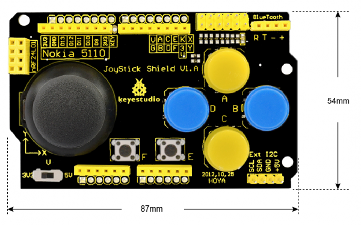
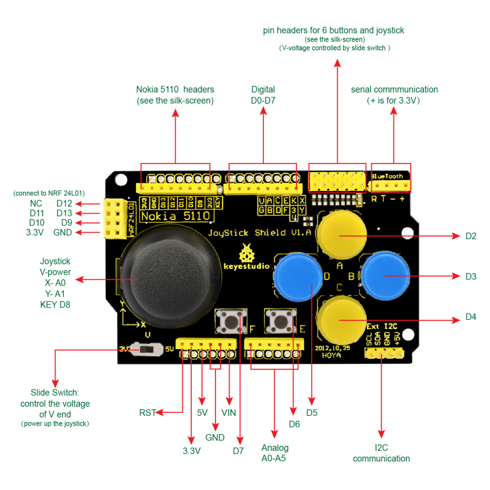
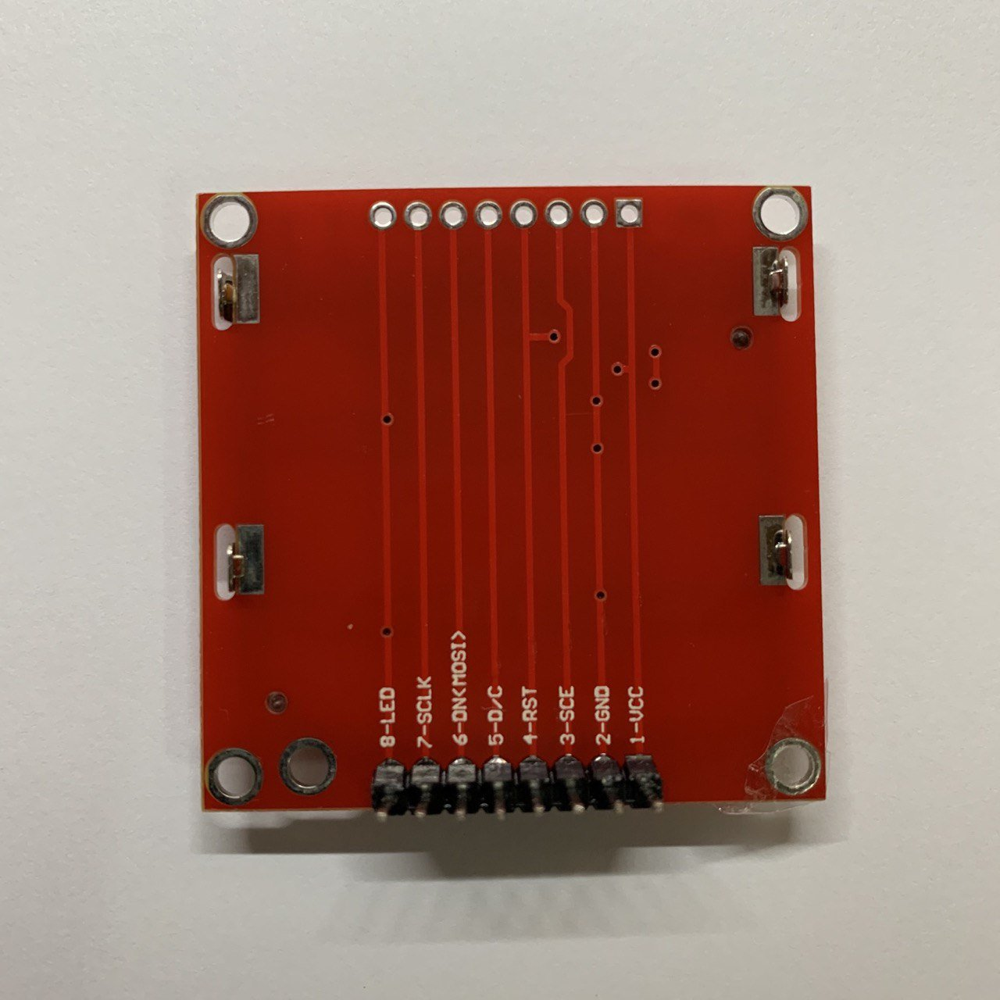

# JoyStick Shield — 复盘索引

对照文章：[JoyStick Shield连接Nokia 5110--Arduino](https://blog.csdn.net/chenchen2360060/article/details/128281176)  
固件权威接线：`main/input_gamepad.h`

## 阅读顺序

1. [本页](README.md) — 黄排针 / A0·A1 对照图（接线基础）
2. [02-E/F 故障与大键改映射](02-ef-fault-and-face-remap.md) — **2026-08-29 已验证**：E/F 弃用，A=START、D=SELECT

## 当前按键映射（2026-08-29）

| 黄排针 | ESP32-S3 | 逻辑 |
|--------|----------|------|
| G | GND | 先接 |
| 3 | 3V3 | 摇杆供电（拨码必须 **3V3**） |
| X | GPIO1 | 摇杆 X（= A0） |
| Y | GPIO2 | 摇杆 Y（= A1） |
| **A** | GPIO15 | **START**（上大键） |
| **B** | GPIO16 | A / 跳 |
| **C** | GPIO17 | B / 跑 |
| **D** | GPIO18 | **SELECT**（左大键；兼菜单亮度 Y） |
| E / F | **可不接** | Shield 小键本机故障，固件 `PAD_ENABLE_EF_KEYS=0` |

退出游戏：左 **D** + 上 **A**（SELECT+START）长按约 1 秒。

## 图（来自 CSDN 文，已入库）

| 文件 | 内容 |
|------|------|
| [assets/joystick-shield-board.png](assets/joystick-shield-board.png) | 实物与丝印总览 |
| [assets/joystick-shield-pinout.png](assets/joystick-shield-pinout.png) | 带红箭头标注（含 X→A0、Y→A1、底边 Analog） |
| [assets/nokia-5110-pinout.jpeg](assets/nokia-5110-pinout.jpeg) | 文章用的 Nokia 5110 排线序（**本项目不用**） |





## A0 / A1 是什么

| Arduino 名 | Shield 含义 | 板上怎么找 |
|---|---|---|
| **A0** | 摇杆 **X** | 摇杆旁丝印 **X** |
| **A1** | 摇杆 **Y** | 摇杆旁丝印 **Y** |

**找丝印 X/Y，不要去 DevKit 上找「A0」「A1」。**

中央 6×2 黄公排针（本项目用）：

```text
上排:  V  A  C  E  K  X
下排:  G  B  D  F  3  Y
```

底边 Analog A0–A5 与黄排针 X/Y **同源**，任选一处飞线即可。Nokia 5110 / nRF24 排针**没有** X/Y。

## 完整对应（摘要）

| Shield | 文章（UNO） | 本项目 ESP32 |
|--------|-------------|--------------|
| X / Y | A0 / A1 | GPIO1 / GPIO2 |
| A/B/C/D | D2–D5 | GPIO15–18（逻辑见上表） |
| E/F | D6/D7 | **本机停用**（详见 [02](02-ef-fault-and-face-remap.md)） |
| G / 3 | GND / 3.3V | GND / 3V3 |

拨码必须 **3V3**。屏用 ST7789（GPIO9–14），见 `docs/hardware.md` §7。


