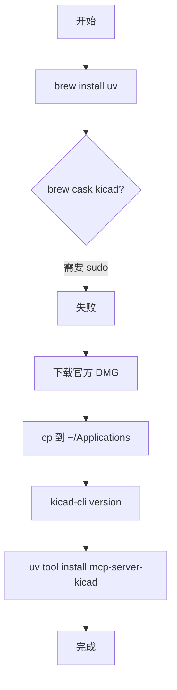

# 02 — 工具链安装

## 目标清单

- [x] `uv`（包管理 / `uvx` 运行 MCP）
- [x] KiCad **10.0.5**
- [x] `mcp-server-kicad` **0.20.1**
- [x] 外网加速：本机 Clash（FlClash）`127.0.0.1:7890`

## 网络代理（可选但本机用了）

```bash
export HTTP_PROXY=http://127.0.0.1:7890
export HTTPS_PROXY=http://127.0.0.1:7890
export ALL_PROXY=http://127.0.0.1:7890
```

确认代理在听：

```bash
lsof -iTCP -sTCP:LISTEN | grep 7890
# 本机看到: FlClashCo ... TCP *:7890 (LISTEN)
```

## 1. 安装 uv

```bash
brew install uv
uv --version
# 本机结果: uv 0.12.5
```

`uv` 类似「更快的 pip + venv 管理」，MCP 官方推荐用 `uvx` 一条命令拉最新 `mcp-server-kicad`。

## 2. 安装 KiCad 10

### 尝试 A：`brew install --cask kicad` — 失败

Homebrew 要把 `demos` 写到 `/Library/Application Support/kicad`，需要 **sudo 密码**。在 Cursor agent 非交互环境里会报：

```text
sudo: a terminal is required to read the password
```

**教训**：公司/自动化环境别假设 brew cask 一定能静默装好 KiCad。

### 尝试 B：官方 DMG → 用户目录 — 成功

```bash
curl -fL -o /tmp/kicad-unified-universal-10.0.5.dmg \
  "https://downloads.kicad.org/kicad/macos/explore/stable/download/kicad-unified-universal-10.0.5.dmg"

hdiutil attach /tmp/kicad-unified-universal-10.0.5.dmg -nobrowse
# 注意：App 在 /Volumes/KiCad/KiCad/KiCad.app，不是 /Volumes/KiCad/KiCad.app

mkdir -p ~/Applications
cp -R "/Volumes/KiCad/KiCad/KiCad.app" ~/Applications/
hdiutil detach "/Volumes/KiCad"

~/Applications/KiCad.app/Contents/MacOS/kicad-cli version
# 10.0.5
```

**为什么放 `~/Applications`**：不需要管理员权限，和 brew 系统级安装效果一样（双击打开工程）。

## 3. 安装 mcp-server-kicad

两种方式等价，任选：

```bash
# 方式 A：临时运行（Cursor MCP 用这个）
uvx --from mcp-server-kicad mcp-server-kicad --help

# 方式 B：装进工具目录
uv tool install mcp-server-kicad
# 可执行文件在 ~/.local/bin/
```

本机版本：**mcp-server-kicad 0.20.1**（109 个 MCP tools，支持 KiCad 9/10 文件读写）。

## 4. 把工具放进 PATH（建议写进 ~/.zshrc）

```bash
export PATH="$HOME/.local/bin:$HOME/Applications/KiCad.app/Contents/MacOS:/opt/homebrew/bin:$PATH"
```

| 命令 | 用途 |
|------|------|
| `kicad-cli` | ERC、DRC、导出 Gerber（MCP 会调） |
| `uv` / `uvx` | 跑 MCP 服务器、跑 bootstrap 脚本 |

## 安装流程图



图源文件：[assets/toolchain-install.mmd](assets/toolchain-install.mmd)

## 验证清单

```bash
which uv && uv --version
which kicad-cli || ~/Applications/KiCad.app/Contents/MacOS/kicad-cli version
uvx --from mcp-server-kicad mcp-server-kicad --help  # 无报错即可
```

全部通过后进入 [03-Cursor-MCP-配置](03-mcp-cursor-setup.md)。
