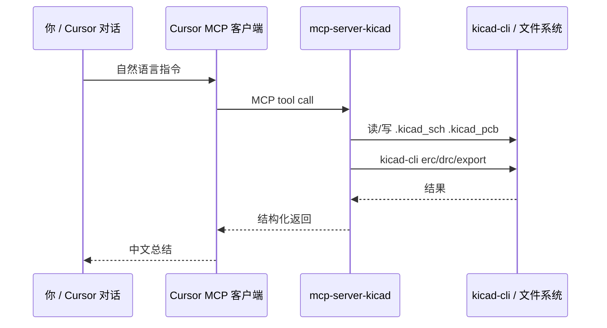

# 03 — Cursor MCP 配置

## MCP 是什么？（一句话）

**Model Context Protocol**：让 Cursor 里的 AI 能调用外部工具（这里是一套 KiCad 读写/ERC/DRC 接口），而不是只能改仓库里的 `.c` 文件。

## 仓库里的配置文件

路径：`.cursor/mcp.json`

```json
{
  "mcpServers": {
    "kicad": {
      "command": "uvx",
      "args": ["--from", "mcp-server-kicad", "mcp-server-kicad"],
      "cwd": "/Users/lizhenhe/esp32/esp32s3-gamebox/hardware/kicad/gamebox-shield",
      "env": {
        "PATH": "/Users/lizhenhe/.local/bin:/opt/homebrew/bin:/Users/lizhenhe/Applications/KiCad.app/Contents/MacOS:/Applications/KiCad.app/Contents/MacOS"
      }
    }
  }
}
```

### 字段说明

| 字段 | 含义 |
|------|------|
| `command` + `args` | 用 `uvx` 拉取并运行 `mcp-server-kicad` |
| `cwd` | KiCad 工程目录；MCP 里相对路径都从这里解析 |
| `env.PATH` | 让 MCP 子进程找到 `kicad-cli`（装在 `~/Applications` 时不在默认 PATH） |

> **换机器时**：把 `cwd` 改成你本机仓库的绝对路径。

## 在 Cursor 里启用

1. 打开本仓库根目录
2. **Settings → MCP**（或 Cursor 设置里的 MCP 面板）
3. 确认出现 `kicad` 服务器，状态为已连接（绿点）
4. 若无：点 **Reload**，或重启 Cursor

## 和 KiCad GUI 的关系

- **mcp-server-kicad 多数写操作直接改磁盘上的 `.kicad_sch` / `.kicad_pcb`**，不强制 KiCad 窗口开着
- **ERC / DRC / 部分导出** 会 shell 出 `kicad-cli`，所以必须装好 KiCad 10
- 你在 KiCad 里开着同一个工程时，保存前注意别和 MCP 同时改同一文件（习惯上：MCP 改完再在 KiCad 里 **重新加载**）

## 可以怎么用？（对话示例）

连上 MCP 后，在 Cursor 对话里可以说：

- 「列出 `gamebox-shield.kicad_pcb` 里所有未连接的网络」
- 「对当前工程跑 DRC，把错误总结成中文」
- 「把 J3 显示屏插座往右移 5mm」
- 「导出 Gerber 到 `hardware/kicad/gerbers/`」

## MCP 数据流（示意图）



图源：[assets/mcp-flow.mmd](assets/mcp-flow.mmd)

## 故障排查

| 现象 | 可能原因 | 处理 |
|------|----------|------|
| MCP 列表里没有 kicad | 未打开本仓库 / json 语法错 | 检查 `.cursor/mcp.json` |
| `kicad-cli not found` | PATH 未带进 env | 补 `KiCad.app/Contents/MacOS` |
| uvx 很慢或失败 | 网络 | 开 Clash，或 `export HTTPS_PROXY=...` |
| 工具列表为空 | 首次 uvx 下载中 | 终端先跑一遍 `uvx --from mcp-server-kicad mcp-server-kicad --help` |

下一步：[04-硬件引脚分析](04-hardware-pin-analysis.md)
