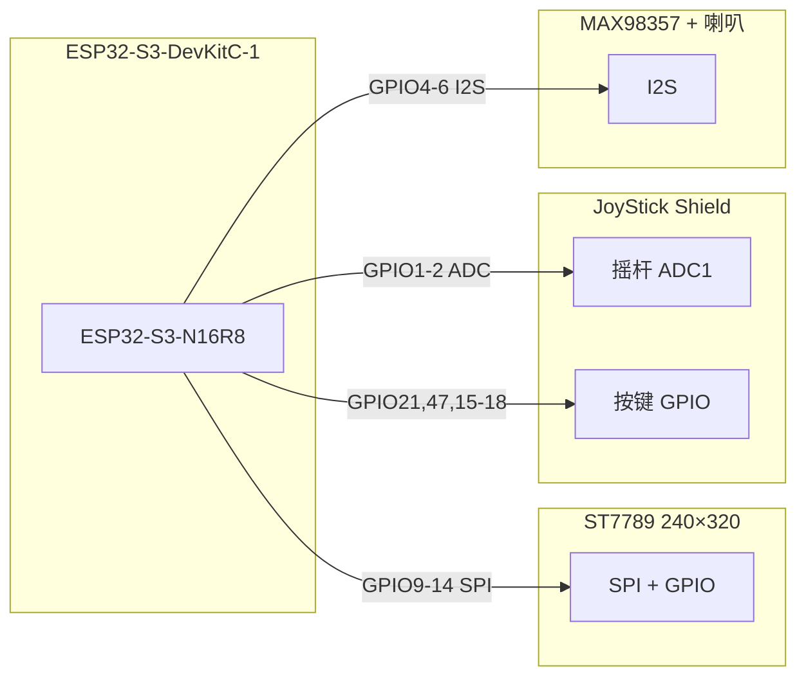

# 04 — 硬件引脚分析（从固件反推载板）

载板必须和**当前固件**一致。下面表格的权威来源是仓库里的头文件和 `docs/hardware.md`。

## 系统框图



## DevKitC-1 双排针（载板 J1 下排 / J2 上排）

以 USB 口朝右、元件面朝上为基准（与 `docs/hardware.md` §2 一致）。

**下排 J1（左 → 右）**

```text
3V3  3V3  RST  4   5   6   7   15  16  17  18  8   3   46  9   10  11  12  13  14  5Vin  GND
```

**上排 J2（左 → 右）**

```text
GND  TX  RX  1   2   42  41  40  39  38  37  36  35  0   45  48  47  21  20  19  GND  GND
```

载板用 **2×22 母座** 从下往上插 DevKitC 公排针。板子尺寸参考：整板约 **63.3 × 28 mm**（`docs/hardware.md` §1）。

## 本工程实际占用的 GPIO

| 功能 | GPIO | 源文件 |
|------|------|--------|
| 摇杆 X | 1 | `main/input_gamepad.h` `PAD_PIN_X` |
| 摇杆 Y | 2 | `PAD_PIN_Y` |
| I2S BCLK | 4 | `main/audio_output.c` `I2S_PIN_BCLK` |
| I2S LRC/WS | 5 | `I2S_PIN_LRC` |
| I2S DIN | 6 | `I2S_PIN_DOUT` |
| START | 21 | `PAD_PIN_START`（Shield E） |
| SELECT | 47 | `PAD_PIN_SELECT`（Shield F） |
| 屏背光 BLK | 9 | `main/display.h` `DISP_PIN_BL` |
| 屏 CS | 10 | `DISP_PIN_CS` |
| 屏 MOSI | 11 | `DISP_PIN_MOSI` |
| 屏 SCK | 12 | `DISP_PIN_SCLK` |
| 屏 RST | 13 | `DISP_PIN_RST` |
| 屏 DC | 14 | `DISP_PIN_DC` |
| 键 A/B/C/D → SNES X/A/B/Y | 15/16/17/18 | `PAD_PIN_SHIELD_*` |
| 板载 RGB LED | 48 | `main/rgb_led.c`（载板不必引出） |

### 故意不用的脚（设计时要避开）

| 脚 | 原因 |
|----|------|
| 33–37 | Octal PSRAM 占用 |
| 19/20 | USB D-/D+ |
| 0/3/45/46 | Strapping |
| 43/44 | UART0 日志 |

## 外设插座定义（载板 v0）

### J3 — ST7789（8 pin）

与 `docs/hardware.md` §7 一致：

| 屏丝印 | 网络 | DevKit GPIO |
|--------|------|-------------|
| GND | GND | GND |
| VCC | +3V3 | 3V3 |
| SCK | GPIO12_SCK | 12 |
| MOSI | GPIO11_MOSI | 11 |
| RST | GPIO13_RST | 13 |
| DC | GPIO14_DC | 14 |
| CS | GPIO10_CS | 10 |
| BLK | GPIO9_BL | 9 |

### J4 — JoyStick Shield（1×10，按 `input_gamepad.h` 杜邦顺序）

| 座子 pin | Shield 丝印 | 网络 |
|----------|-------------|------|
| 1 | G | GND |
| 2 | 3 | +3V3（**Shield 拨码必须在 3V3**） |
| 3 | X | GPIO1 |
| 4 | Y | GPIO2 |
| 5 | A | GPIO15 |
| 6 | B | GPIO16 |
| 7 | C | GPIO17 |
| 8 | D | GPIO18 |
| 9 | F | GPIO47 SELECT |
| 10 | E | GPIO21 START |

### J5 — MAX98357（6 pin 模块）

| 模块 | 网络 | GPIO |
|------|------|------|
| VIN | +3V3 | — |
| GND | GND | — |
| BCLK | GPIO4_BCLK | 4 |
| LRC | GPIO5_LRC | 5 |
| DIN | GPIO6_DIN | 6 |
| SD | 悬空 | 模块常带上拉 |

### J6 — 喇叭

接 MAX98357 的 **SPK+ / SPK-**（桥接输出，**任一端不能接 GND**）。v0 原理图留了 2 pin 座，需在布局时靠近功放模块走线。

## 载板物理布局（概念）

```text
        ┌─────────────────────────────┐
        │  J3 屏   J4 手柄   J5 音频   │
        │   │        │        │       │
        │   └────────┴────────┘       │
        │         走线层（待布）        │
        │    ┌── J1 ──────────────┐   │
        │    │   DevKitC 插在这里   │   │
        │    └── J2 ──────────────┘   │
        └─────────────────────────────┘
```

下一步：[05-PCB-v0-生成](05-pcb-v0-generation.md)
