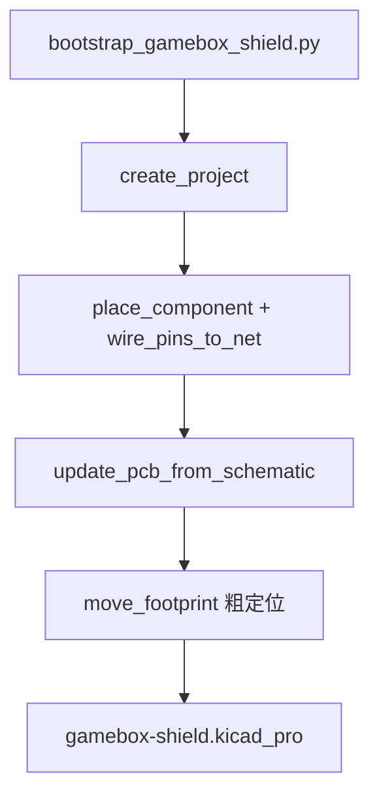

# 05 — PCB v0 生成

## 工程文件位置

```text
hardware/kicad/gamebox-shield/
├── gamebox-shield.kicad_pro    ← KiCad 里打开这个
├── gamebox-shield.kicad_sch    ← 原理图
├── gamebox-shield.kicad_pcb    ← PCB（封装已放，未布线）
└── gamebox-shield.kicad_prl    ← 本地 UI 状态
```

## 一键重新生成

脚本会**删掉整个 `gamebox-shield/` 目录再重建**（不要在 KiCad 里开着该工程时跑）。

```bash
export PATH="$HOME/.local/bin:$HOME/Applications/KiCad.app/Contents/MacOS:$PATH"
export KICAD_SYMBOL_DIR="$HOME/Applications/KiCad.app/Contents/SharedSupport/symbols"

cd /Users/lizhenhe/esp32/esp32s3-gamebox
uv run --with mcp-server-kicad python hardware/kicad/bootstrap_gamebox_shield.py
```

脚本路径：`hardware/kicad/bootstrap_gamebox_shield.py`

### 脚本做了什么？

1. `create_project` — 建 `.kicad_pro` + 空原理图
2. `place_component` — 放 J1–J6 连接器符号，指定封装（2.54 mm 排母）
3. `add_power_symbol` / `add_global_label` — 电源与网络名
4. `wire_pins_to_net` — 按 [04-硬件引脚分析](04-hardware-pin-analysis.md) 自动连线
5. `update_pcb_from_schematic` — 把封装和网表推到 PCB
6. `move_footprint` — 粗略摆放（DevKit 居中，外设座在右侧）

底层用的是 **mcp-server-kicad 的 Python API**（和 Cursor MCP 同一套逻辑），保证不写坏 KiCad 文件格式。

## 原理图位号一览

| 位号 | 值 | 封装 |
|------|-----|------|
| J1 | DevKitC 下排 | `PinSocket_1x22_P2.54mm_Vertical` |
| J2 | DevKitC 上排 | 同上 |
| J3 | ST7789 SPI | `PinSocket_1x08` |
| J4 | JoyStick Shield | `PinSocket_1x10` |
| J5 | MAX98357 | `PinSocket_1x06` |
| J6 | Speaker | `PinSocket_1x02` |

## PCB 当前封装坐标（mm，仅供参考）

| 位号 | X | Y | 旋转 |
|------|---|---|------|
| J1 | 35 | 30 | 0° |
| J2 | 35 | 58 | 0° |
| J3 | 72 | 22 | 90° |
| J4 | 72 | 38 | 90° |
| J5 | 72 | 48 | 90° |
| J6 | 72 | 54 | 90° |

## 用 KiCad 打开

```bash
open ~/Applications/KiCad.app
# 文件 → 打开 → gamebox-shield.kicad_pro

# 或命令行：
open /Users/lizhenhe/esp32/esp32s3-gamebox/hardware/kicad/gamebox-shield/gamebox-shield.kicad_pro
```

建议第一次打开后：

1. **原理图编辑器** → 检查 J1/J2 符号方向是否与 DevKit 丝印一致
2. **原理图** → 工具 → **执行电气规则检查（ERC）**
3. **PCB 编辑器** → 目前还没有铜箔，DRC 会报很多未连接——正常

## v0 完成度

| 项目 | 状态 |
|------|------|
| 连接器符号 + 封装 | ✅ |
| 网络命名（与固件一致） | ✅ |
| 原理图自动连线 | ⚠️ 见 [06-思考与踩坑](06-thinking-and-pitfalls.md) |
| PCB 布线 | ❌ |
| 板框 / 铺铜 | ❌ |
| DRC 通过 | ❌ |
| Gerber | ❌ |

## 生成流程图



图源：[assets/bootstrap-flow.mmd](assets/bootstrap-flow.mmd)
