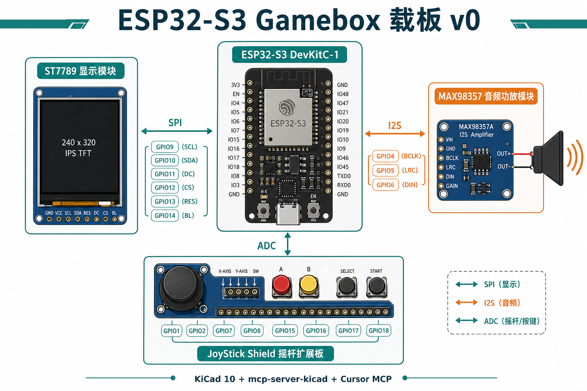

# KiCad Gamebox 载板 — 复盘索引

从零安装 **KiCad 10 + uv + mcp-server-kicad + Cursor MCP**，并根据本仓库固件引脚生成 **ESP32-S3-DevKitC-1 载板 PCB v0**。

**日期**：2026-08-22  
**环境**：macOS（Apple Silicon），Clash/FlClash 代理 `127.0.0.1:7890`

## 阅读顺序（建议按序看）

| # | 文件 | 内容 |
|---|------|------|
| 1 | [01-目标与背景](01-goal-and-background.md) | 为什么要做载板、和洞洞板方案的关系 |
| 2 | [02-工具链安装](02-toolchain-install.md) | uv、KiCad 10、mcp-server-kicad 安装实录 |
| 3 | [03-Cursor-MCP-配置](03-mcp-cursor-setup.md) | `.cursor/mcp.json` 与验证 |
| 4 | [04-硬件引脚分析](04-hardware-pin-analysis.md) | 从固件反推载板该接什么 |
| 5 | [05-PCB-v0-生成](05-pcb-v0-generation.md) | 脚本、工程文件、当前完成度 |
| 6 | [06-思考与踩坑](06-thinking-and-pitfalls.md) | agent 决策过程、失败与修正 |
| 7 | [07-下一步](07-next-steps.md) | 你在 KiCad / MCP 里该继续做什么 |
| 8 | [08-ERC-修正实录](08-erc-fix-log.md) | bootstrap v1：J1/J2 布局 + 映射表 + ERC 通过 |

## 一图总览



## 关键路径（复制用）

```text
KiCad 工程:  hardware/kicad/gamebox-shield/gamebox-shield.kicad_pro
生成脚本:    hardware/kicad/bootstrap_gamebox_shield.py
MCP 配置:    .cursor/mcp.json
固件引脚权威: docs/hardware.md + main/display.h + main/input_gamepad.h + main/audio_output.c
```

## 当前状态（v1，2026-08-22 重生）

- [x] 工具链装好（KiCad 10.0.5、uv、mcp-server-kicad 0.20.1）
- [x] Cursor MCP 配置写入仓库
- [x] 原理图：连接器 + 映射表连线 + **ERC 0 error**（SPK± 各 1 warning，见 08）
- [x] J1/J2 水平并排，消除 v0 Y 重叠错网
- [x] PCB：封装已放置，**尚未布线、未 DRC**
- [ ] KiCad 肉眼核对 J1/J2 与 DevKit 丝印方向
- [ ] 板框、铺铜、Gerber 导出

## 相关仓库文档

- [docs/hardware.md](../../hardware.md) — 板卡与接线实测
- [AGENTS.md](../../../AGENTS.md) §学习复盘文档 — agent 今后如何继续写本系列
