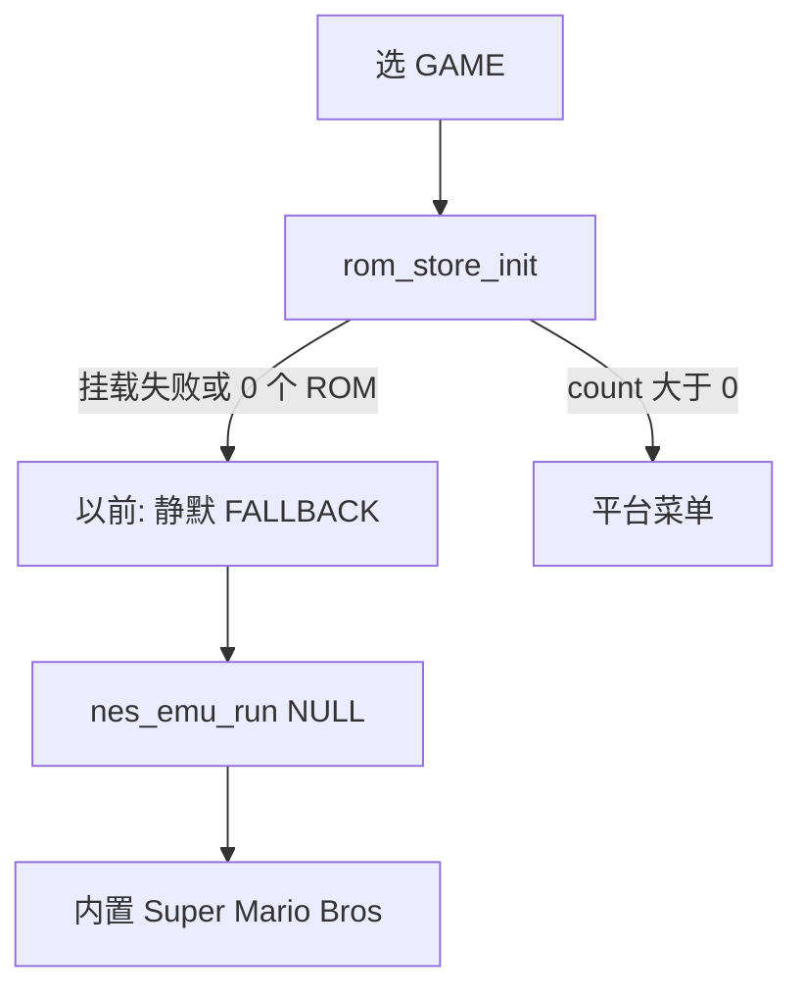
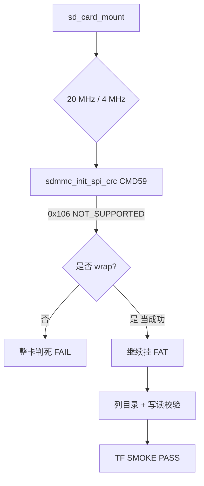
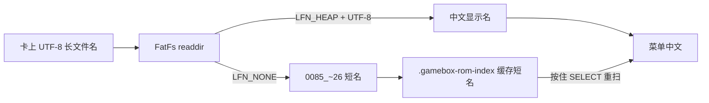

# TF 卡：空菜单 / 挂载 / 冒烟 / 中文名

> 日期：2026-09-02 起，**2026-09-04 补齐冒烟与长文件名踩坑**  
> 面向：硬件/IDF 新手复盘；命令可复制。

本话题串起三件看起来像「菜单坏了」的事，其实是三条不同因果链：

| 现象 | 根因层 | 结论 |
|---|---|---|
| 进 GAME 直接超级玛丽 | 扫描 count=0 → 旧版静默 FALLBACK | 已改提示页；先分「未挂载」vs「空 ROM」 |
| 冒烟 `ESP_ERR_NOT_SUPPORTED (0x106)` | 卡拒 SPI CRC_ON_OFF | 接线 OK；`--wrap` 放过 0x106 |
| 菜单 `0085_~26` 无中文名 | FatFs 只有 8.3 短名 | **不用改卡上文件名**；`sdkconfig` 未吃到 LFN defaults |

## 阅读顺序（本目录）

1. 下文「空目录 → 玛丽」—— 2026-09-02  
2. [最小冒烟与 0x106](#2026-09-04最小-tf-冒烟固件推荐)  
3. [中文名变短名](#2026-09-04菜单显示-0085_26-而不是中文名)  
4. [思考过程总览](#思考过程2026-09-04)

---

## 为什么会这样（空目录 → 玛丽）



游戏只从 TF 卡读。`rom_menu_pick()` 里 `count <= 0` 时旧逻辑立刻返回
`ROM_MENU_FALLBACK`，`app_main` 用 `entry=NULL` 启动 NES，加载的是
`main/nes_emu.c` 里 `ROM_CHOICE=0` 嵌进固件的 `smb.nes`。

所以屏上看到玛丽 = **菜单根本没开成**，不是卡上只扫到玛丽。

## 先自查（硬件 / 卡内容）

一次只改一个变量：

1. **卡有没有插紧**，座子 3V3/GND/CS/MOSI/CLK/MISO 是否对应  
   `GPIO39/41/40/42`（见 `docs/hardware.md` §10）。
2. **文件系统必须是 FAT16/FAT32**（exFAT 默认挂不上）。
3. 电脑上把 ROM 拷到卡根下约定目录（扩展名认平台，目录名只是约定）：

```text
/roms/nes/*.nes
/roms/gb/*.gb
/roms/gbc/*.gbc
/roms/snes/*.{sfc,smc}
/roms/md/*.{md,bin}
/roms/pce/*.{pce,sgx}
```

也可散落在卡上任意子目录；`.nes` / `.zip` 等扩展名会被递归扫到（最多 4 层）。

4. 烧录后开 `idf.py monitor`，看串口 tag：
   - `sd_card`：挂载成功/失败原因（超时、找不到卡、非 FAT、0x106…）
   - `rom_store`：`TF 卡：N 个游戏可用` 或从目录缓存载入的条数  
   - `menu`：无游戏时会打「停在提示页」

加删游戏后若列表仍旧，开机**按住 SELECT（大键 D）**再 RESET，强制忽略
`.gamebox-rom-index` 缓存并全盘重扫。

## 固件侧改动（空目录提示页）

旧行为：0 游戏 → 无提示 → 直进内置玛丽（像坏了）。  
新行为：0 游戏 → 屏上「没有游戏」，区分：

| 屏上文案 | 含义 |
|---|---|
| TF 卡未挂载 | `sd_card_mount` 失败：接线 / 供电 / 非 FAT / 卡拒命令 |
| 卡上未找到 ROM | 卡挂上了，但扫描扩展名结果为 0 |

- **B**：回 GAME/WORDS/SETTINGS  
- **A**：才主动玩内置 NES  

代码：`main/rom_menu.c` 的 `show_empty_catalog()`。

## 思考过程（2026-09-02）

用户说「感觉没有从 TF 卡读出所有游戏」——第一反应可能是扫描截断或缓存坏了。
但「直接进玛丽」和「菜单只显示一部份」症状不同：前者对应 `count==0` 的
FALLBACK 路径，后者至少会先画平台页。对照 `AGENTS.md` 里原有警告
「没卡时屏幕上没有任何提示，直接进内置游戏」，与现象一字不差，所以先补
提示页，再让用户用串口区分挂载失败还是空目录。

## 2026-09-02：卡内容正常，但屏上「TF 卡未挂载」

电脑侧已核实：`/Volumes/UNTITLED` 为 FAT16、`/roms/nes/` 有 23 个合法 iNES。  
屏上仍报未挂载 → **问题在板子 SPI 接线/供电，不是格式或 ROM。**

固件约定（模块丝印 → GPIO）：

| 丝印 | GPIO |
|---|---|
| 3V3 | 3V3（勿接 5V） |
| GND | GND |
| CLK | 39 |
| MOSI | 41 |
| MISO | 40 |
| CS | 42 |

单变量对照：一次只拔/重插一根线或只确认卡是否插到底，看屏上提示是否从「未挂载」变成平台菜单。  
新固件会在未挂载页显示更短的原因行（卡无响应 / 未找到卡 / 响应乱…）。

---

## 2026-09-04：最小 TF 冒烟固件（推荐）

不要为了测卡去烧整包模拟器。根 `CMakeLists.txt` 有开关 `SD_SMOKE_ONLY`：
打开后 `main` **只**编 `sd_card.c` + `sd_smoke_main.c`，不链屏/音频/模拟器
（app ≈ 338 KB，正式版 ≈ 1.8 MB）。

```bash
export PATH="$HOME/.espressif/python_env/idf5.4_py3.12_env/bin:/opt/homebrew/opt/python@3.12/bin:$PATH"
. ~/esp/esp-idf/export.sh
cd /Users/lizhenhe/esp32/esp32s3-gamebox

# 切开关必须 fullclean，否则 CMake 缓存里的 SRCS 列表还是旧的
idf.py fullclean
idf.py -DSD_SMOKE_ONLY=1 build
PORT=$(ls /dev/cu.usbmodem* 2>/dev/null | head -1)
# 烧前：按住 BOOT → 点 RESET → 松开 BOOT
idf.py -p "$PORT" -b 115200 flash monitor   # 退出: Ctrl+]
```

串口应出现 `======== TF 冒烟（最小固件）========`，然后：

1. `挂载 TF 卡：SPI3 CLK=39 …` → 成功则 `TF 卡就绪 @ N kHz`
2. 卡信息块、根目录列表
3. `读写校验 通过` 与扇区基准（冒烟构建强制开 `SD_BENCHMARK`）
4. 结尾 `*** TF SMOKE PASS ***` 或 `FAIL`（失败时带接线提示）

测完回正式固件：

```bash
idf.py fullclean
idf.py -DSD_SMOKE_ONLY=0 build flash
```

### 上板结果：0x106 → wrap → PASS



第一轮：`*** TF SMOKE FAIL ***`，`ESP_ERR_NOT_SUPPORTED (0x106)`，
卡在 `sdmmc_init_spi_crc`（CMD59 开 SPI CRC）。20/4 MHz 都挂不上。
容易误判成「接线坏了」——其实卡已经有应答（`cmd=52/5 command not supported`
对 SD-over-SPI 探测是常见噪声）。

第二轮（**单变量：只改软件**）：用 `--wrap=sdmmc_init_spi_crc` 把 `0x106`
当成功（SPI 数据 CRC 对主机可选；见 [IDFGH-14710](https://github.com/espressif/esp-idf/issues/15450)）。
**不改接线** 重烧后：

```text
W sd_card: 卡拒绝开启 SPI CRC（0x106），按可选处理继续挂载
I sd_card: TF 卡就绪 @ 20000 kHz：SD128，容量 120 MB，可用 113 MB
读写校验 通过 @ 20000 kHz
*** TF SMOKE PASS ***
```

基准也正常（CMD13 ≈ 95 µs/次，不是老卡那种 38 ms）。结论：不是接线坏了，
是这张 **SD128** 在 SPI 下拒 CRC_ON_OFF。

| 代码位置 | 作用 |
|---|---|
| `main/sd_card.c` 的 `__wrap_sdmmc_init_spi_crc` | 放过 0x106 |
| `main/CMakeLists.txt` `-Wl,--wrap=sdmmc_init_spi_crc` | 冒烟与正式固件都链上 |
| `main/sd_smoke_main.c` | 最小入口，PASS/FAIL 横幅 |

### 恢复正式固件

`idf.py fullclean && idf.py -DSD_SMOKE_ONLY=0 build flash` 已完成。
正式 app ≈ 1.8 MB，链接带同样的 CRC wrap。

### 抓串口时的小坑（USB-JTAG）

用 pyserial 打开口时若默认拉高 DTR/RTS，ESP32-S3 会进
`waiting for download`，冒烟固件根本不跑。正确做法：打开前 `dtr=False; rts=False`，
或用 `esptool ... chip_id`（`--after hard_reset`）复位后再听，**不要**手拨 RTS 进下载。

---

## 2026-09-04：菜单显示 `0085_~26` 而不是中文名

**不用改 SD 文件名，也不用改菜单绘制逻辑。**



`0085_~26` 是 FAT **8.3 短名**（和冒烟时根目录的 `FSEVEN~1` / `SPOTLI~1` 同类）。
电脑上中文长名还在；当时固件的 `sdkconfig` 仍是：

```text
CONFIG_FATFS_LFN_NONE=y
```

而 `sdkconfig.defaults` 里早就写了：

```text
CONFIG_FATFS_LFN_HEAP=y
CONFIG_FATFS_MAX_LFN=128
CONFIG_FATFS_API_ENCODING_UTF_8=y
```

IDF **只在 `sdkconfig` 不存在时**读 defaults；已有文件会赢。这是 `AGENTS.md`
写明的坑——改 defaults 后必须 `rm sdkconfig` 再 build。菜单只是如实显示
`readdir` 拿到的短名；`rom_store` 的 `display_name()` 还会去掉 `NN_` 之类前缀，
但对整段短名 `0085_~26` 无能为力。

### 处理（本机已做）

```bash
rm -f sdkconfig
idf.py -DSD_SMOKE_ONLY=0 reconfigure   # 确认 LFN_HEAP / UTF_8 进 sdkconfig
idf.py build
idf.py -p /dev/cu.usbmodemXXXX -b 115200 flash
```

烧完开机**按住 SELECT（大键 D）再 RESET**，强制刷新 `.gamebox-rom-index`
（旧缓存里存的是短名，不重扫会继续显示 `0085_~26`）。

2026-09-04 晚：含 LFN 的正式固件已烧上 `/dev/cu.usbmodem1101`。

---

## 思考过程（2026-09-04）

1. **「单独测 TF」**：完整固件日志太吵、体积大。用 CMake 开关换迷你 `app_main`，
   比另开工程省事，引脚/自检与正式版共用 `sd_card.c`。
2. **0x106 先别怪线**：降频对照两档都失败，但有命令应答 → 不像断线。查 IDF
   issue 发现「部分卡拒 CRC_ON_OFF」是已知路径；单变量只加 wrap，PASS 就坐实。
3. **短名不是显示 bug**：用户问「改文件名还是改显示」。对照冒烟根目录已是
   `~1` 形态 + `sdkconfig` 里 `LFN_NONE`，因果链闭合。若去改菜单或批量改卡上
   文件名，是在错误层「修」。
4. **缓存是第二刀**：即使 LFN 生效，不重扫索引仍会显示旧短名——所以 SELECT
   强制刷新必须写进步骤。

## 关键产物一览

| 路径 | 说明 |
|---|---|
| 根 `CMakeLists.txt` `SD_SMOKE_ONLY` | 最小 TF 冒烟开关 |
| `main/sd_smoke_main.c` | 冒烟入口 |
| `main/sd_card.c` | 挂载、自检、CRC wrap、hint |
| `main/CMakeLists.txt` | 冒烟/正式两套 SRCS + wrap |
| `sdkconfig.defaults` | LFN_HEAP / UTF-8（改完要删 `sdkconfig`） |
| `AGENTS.md` 诊断表 | `SD_SMOKE_ONLY` / `SD_SELFTEST` / `SD_BENCHMARK` |
